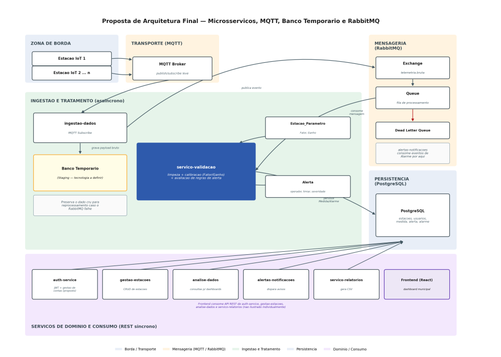
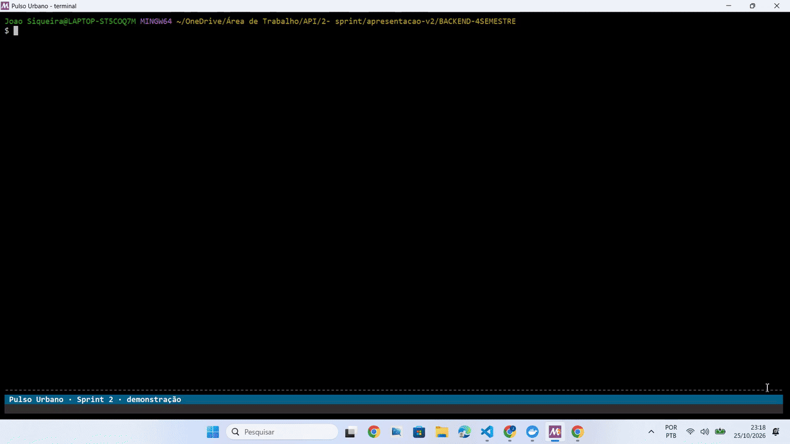

# API DSM - 4º SEMESTRE 2026

<h2 align="center"> ELEMENTARES </h2>

<p align="center">
**🏠 Início** · [Backlog](docs/backlog.md) · [Sprint 1](docs/sprints/sprint-1.md) · [Sprint 2](docs/sprints/sprint-2.md) · [Sprint 3](docs/sprints/sprint-3.md) · [Requisitos](docs/requisitos.md) · [Arquitetura](docs/arquitetura.md) · [Processo](docs/processo.md) · [Qualidade](docs/qualidade.md) · [Instalação](docs/instalacao.md)
</p>

<p align="center">
  <a href="#sobre">Visão Geral</a> |
  <a href="#sprints">Sprints</a> |
  <a href="#backlog">Backlog</a> |
  <a href="#documentacao">Documentação</a> |
  <a href="#executar">Como executar</a> |
  <a href="#tecnologias">Tecnologias</a> |
  <a href="#equipe">Nossa Equipe</a>
</p>

> **Tema:** Smart Cities 🏙️
>
> **Fase Atual:** Sprint 3 — Estação física, API pública e entrega final 🚀

### 🔗 Links Rápidos

| Recurso | Link |
| --- | :--: |
| 📋 Board do Produto (Jira) | [Acessar Backlog](https://elementares-4sem.atlassian.net/jira/software/projects/ELEM/boards/2/backlog) |
| 🖥️ Repositório Backend | [BACKEND-4SEMESTRE](https://github.com/ELEMENTARES-DSM/BACKEND-4SEMESTRE) |
| 🎨 Repositório Frontend | [FRONTEND-4SEMESTRE](https://github.com/ELEMENTARES-DSM/FRONTEND-4SEMESTRE) |
| 🏗️ Documento de Arquitetura | [`Arquitetura.pdf`](docs/Arquitetura.pdf) |
| 🗄️ Modelo de Dados | [`Modelo_de_Dados.pdf`](docs/Modelo_de_Dados.pdf) |
| 🎬 Sprints e demonstrações | [Ver seção Sprints](#sprints) |
| 📄 Documentação | [Ver seção Documentação](#documentacao) |
| 👥 GitHub e LinkedIn do time | [Ver seção Nossa Equipe](#equipe) |

---

## 🎯 Visão Geral <a id="sobre"></a>

### 🏢 Parceiro de Negócio (Cliente)

**Diogo Branquinho** (Representando a empresa **TECSUS**).

A [Tecsus](https://www.tecsus.com.br/) é uma empresa de tecnologia especializada em soluções inteligentes para o controle e gestão de utilidades (água, energia e gás) em empresas com múltiplas unidades. Com mais de 10 anos de mercado, a Tecsus atua ajudando negócios a obter visibilidade sobre seus consumos, reduzir desperdícios e automatizar processos operacionais com eficiência e inovação. Seu foco está muito alinhado com as práticas de ESG (Ambiental, Social e Governança), buscando sempre uma gestão sustentável e inteligente.

### ⚠️ A Dor

Municípios e consórcios intermunicipais não possuem hoje uma rede acessível de monitoramento ambiental contínuo, o que dificulta identificar variações críticas de qualidade do ar e condições climáticas em tempo hábil. Sem um histórico confiável de temperatura, umidade, vento e concentração de poluentes como o PM2.5, gestores públicos ficam sem uma base de dados estruturada para embasar decisões e agir preventivamente diante de eventos ambientais críticos.

### 🚀 O Desafio

Construir uma plataforma capaz de capturar continuamente dados de estações meteorológicas de baixo custo, processá-los de forma confiável e disponibilizá-los como série histórica estruturada — assegurando isolamento territorial entre municípios do consórcio, controle de acesso por perfil e resiliência na ingestão, de modo que nenhuma leitura de campo seja perdida.

### ✨ A Solução

O **Pulso Urbano** é uma rede de estações de baixo custo que mede continuamente a qualidade do ar e as condições do clima — como temperatura, umidade, vento e chuva. Os dados ficam disponíveis para o usuário em painéis, relatórios e séries históricas, e a plataforma avisa automaticamente quando algum valor ultrapassa um limite considerado preocupante, ajudando a acompanhar as condições ambientais e tomar decisões com base em informação confiável.



Cada estação publica as leituras por MQTT. O serviço de ingestão grava a mensagem bruta no banco temporário (Valkey) e a envia pelo RabbitMQ ao serviço de validação, que aplica as regras, calibra e grava o dado tratado no PostgreSQL, onde nada é apagado. Detalhes em [Arquitetura](docs/arquitetura.md).

---

## 📅 Sprints <a id="sprints"></a>

| Sprint | Período | Objetivo | Status |
| --- | --- | --- | --- |
| [**Sprint 1**](docs/sprints/sprint-1.md) | 07/09 a 27/09 | **MVP 1:** Governança de Usuários, Autenticação, Gestão de Estações, Monitoramento de Conectividade e Regras de Alerta. | ✅ Encerrada |
| [**Sprint 2**](docs/sprints/sprint-2.md) | 05/10 a 25/10 | **MVP 2:** Recepção de dados de ponta a ponta (ingestão, validação, calibração e gravação) + alertas e alarmes. | ✅ Encerrada |
| [**Sprint 3**](docs/sprints/sprint-3.md) | 02/11 a 22/11 | **MVP 3:** Estação física funcionando, leituras guardadas primeiro no banco temporário (Valkey), painel e API pública com cadastro, período e cota por perfil, e entrega final na Prefeitura. | 🚧 Em andamento |

<details>
<summary><b>Demonstrações</b></summary>

<br>

**Sprint 1**


**Sprint 2**



**Sprint 3:** _em breve._

</details>

---

## 📌 Backlog <a id="backlog"></a>

As sprints vêm em ordem de prioridade: a Sprint 1 antes da 2, e a 2 antes da 3. Dentro de cada sprint, o número da US segue a prioridade. Os itens de plataforma, DevOps e qualidade (EPIC-04) atravessam as sprints e ficam numa tabela própria. A fonte da prioridade é o campo Prioridade do Jira.

<details>
<summary><b>Sprint 1 · 07/09 a 27/09 · fundação da plataforma (1ª Entrega)</b></summary>

| US | História | Prioridade | Status | Jira |
| :--: | --- | :--: | :--: | :--: |
| US-01 | Gestão administrativa de contas e perfis | Alta | ✅ Finalizado | [ELEM-6](https://elementares-4sem.atlassian.net/browse/ELEM-6) |
| US-02 | Autenticação e controle de sessão | Alta | ✅ Finalizado | [ELEM-11](https://elementares-4sem.atlassian.net/browse/ELEM-11) |
| US-03 | Cadastro e gestão de estações | Alta | ✅ Finalizado | [ELEM-16](https://elementares-4sem.atlassian.net/browse/ELEM-16) |
| US-04 | Monitoramento de disponibilidade das estações | Alta | ✅ Finalizado | [ELEM-23](https://elementares-4sem.atlassian.net/browse/ELEM-23) |
| US-05 | Parametrização e calibração de sensores | Alta | ✅ Finalizado | [ELEM-27](https://elementares-4sem.atlassian.net/browse/ELEM-27) |
| US-06 | Regras e limiares de alerta | Alta | ✅ Finalizado | [ELEM-32](https://elementares-4sem.atlassian.net/browse/ELEM-32) |

</details>

<details>
<summary><b>Sprint 2 · 05/10 a 25/10 · recepção de dados de ponta a ponta, alertas e alarmes</b></summary>

| US | História | Prioridade | Status | Jira |
| :--: | --- | :--: | :--: | :--: |
| US-11 | Receber leituras das estações via MQTT | Média | ✅ Finalizado | [ELEM-73](https://elementares-4sem.atlassian.net/browse/ELEM-73) |
| US-12 | Validar payload e estação ativa | Média | ✅ Finalizado | [ELEM-74](https://elementares-4sem.atlassian.net/browse/ELEM-74) |
| US-13 | Ignorar leituras duplicadas | Média | ✅ Finalizado | [ELEM-75](https://elementares-4sem.atlassian.net/browse/ELEM-75) |
| US-14 | Gravar no staging e atualizar o último sinal | Média | ✅ Finalizado | [ELEM-76](https://elementares-4sem.atlassian.net/browse/ELEM-76) |
| US-15 | Publicar em `telemetria.bruta` | Média | ✅ Finalizado | [ELEM-77](https://elementares-4sem.atlassian.net/browse/ELEM-77) |
| US-17 | Calibrar e gravar em `medidas` | Média | ✅ Finalizado | [ELEM-79](https://elementares-4sem.atlassian.net/browse/ELEM-79) |
| US-18 | Tratar leituras de sensor inexistente ou inativo | Média | ✅ Finalizado | [ELEM-80](https://elementares-4sem.atlassian.net/browse/ELEM-80) |
| US-19 | Marcar como inválido o valor fisicamente impossível | Média | ✅ Finalizado | [ELEM-81](https://elementares-4sem.atlassian.net/browse/ELEM-81) |
| US-20 | Tratar falha de gravação e reenviar eventos da DLQ | Média | ✅ Finalizado | [ELEM-82](https://elementares-4sem.atlassian.net/browse/ELEM-82) |
| US-22 | Avaliar regras de alerta e registrar alarme | Média | ✅ Finalizado | [ELEM-137](https://elementares-4sem.atlassian.net/browse/ELEM-137) |
| US-23 | Avisar gestores sobre alarme disparado | Média | ✅ Finalizado | [ELEM-138](https://elementares-4sem.atlassian.net/browse/ELEM-138) |
| US-24 | Tela de alarmes e indicador | Média | ✅ Finalizado | [ELEM-139](https://elementares-4sem.atlassian.net/browse/ELEM-139) |

</details>

<details open>
<summary><b>Sprint 3 · 02/11 a 22/11 · estação física, API pública e entrega final</b></summary>

| US | História | Prioridade | Status | Jira |
| :--: | --- | :--: | :--: | :--: |
| US-26 | Estação envia as leituras dos sensores | Baixa | Pronto (DoR ok) | [ELEM-154](https://elementares-4sem.atlassian.net/browse/ELEM-154) |
| US-27 | Estação guarda as leituras quando a rede cai | Baixa | Pronto (DoR ok) | [ELEM-155](https://elementares-4sem.atlassian.net/browse/ELEM-155) |
| US-28 | Leitura antiga não gera alarme | Baixa | Validação PO | [ELEM-156](https://elementares-4sem.atlassian.net/browse/ELEM-156) |
| US-29 | Acesso de cada estação ao broker | Baixa | Pronto (DoR ok) | [ELEM-157](https://elementares-4sem.atlassian.net/browse/ELEM-157) |
| US-30 | Instalar, calibrar e aceitar a estação | Baixa | Pronto (DoR ok) | [ELEM-158](https://elementares-4sem.atlassian.net/browse/ELEM-158) |
| US-31 | Consultar medições e exportar em CSV | Baixa | Validação PO | [ELEM-159](https://elementares-4sem.atlassian.net/browse/ELEM-159) |
| US-35 | Dashboards da qualidade do ar e das estações | Baixa | Pronto (DoR ok) | [ELEM-182](https://elementares-4sem.atlassian.net/browse/ELEM-182) |
| US-36 | Fluxo completo do frontend | Baixa | Pronto (DoR ok) | [ELEM-183](https://elementares-4sem.atlassian.net/browse/ELEM-183) |
| US-37 | Fluxo completo do backend | Baixa | Pronto (DoR ok) | [ELEM-184](https://elementares-4sem.atlassian.net/browse/ELEM-184) |
| US-38 | Entregáveis de implantação na Prefeitura | Baixa | Pronto (DoR ok) | [ELEM-185](https://elementares-4sem.atlassian.net/browse/ELEM-185) |
| US-39 | Cadastrar qualquer grandeza | Baixa | A fazer | [ELEM-261](https://elementares-4sem.atlassian.net/browse/ELEM-261) |
| US-40 | Valkey como banco temporário (staging) da recepção | Baixa | Pronto (DoR ok) | [ELEM-207](https://elementares-4sem.atlassian.net/browse/ELEM-207) |
| US-41 | Entrega do MVP 3 | Baixa | A fazer | [ELEM-262](https://elementares-4sem.atlassian.net/browse/ELEM-262) |
| US-42 | API pública com cadastro, perfis e cotas | Baixa | A fazer | [ELEM-263](https://elementares-4sem.atlassian.net/browse/ELEM-263) |

</details>

<details>
<summary><b>Plataforma, DevOps e Qualidade · itens contínuos</b></summary>

| US | História | Prioridade | Status | Jira |
| :--: | --- | :--: | :--: | :--: |
| US-07 | Documentação e rastreabilidade | Alta | 🔄 Em andamento | [ELEM-58](https://elementares-4sem.atlassian.net/browse/ELEM-58) |
| US-08 | Repositórios e arquitetura de código | Alta | ✅ Finalizado | [ELEM-59](https://elementares-4sem.atlassian.net/browse/ELEM-59) |
| US-09 | Observabilidade e processos de QA | Alta | 🔄 Em andamento | [ELEM-60](https://elementares-4sem.atlassian.net/browse/ELEM-60) |
| US-10 | Testes de integração e cobertura mínima | Alta | ✅ Finalizado | [ELEM-61](https://elementares-4sem.atlassian.net/browse/ELEM-61) |
| US-16 | Simulador de estações | Média | ✅ Finalizado | [ELEM-78](https://elementares-4sem.atlassian.net/browse/ELEM-78) |
| US-21 | Teste contínuo da ingestão | Média | ✅ Finalizado | [ELEM-136](https://elementares-4sem.atlassian.net/browse/ELEM-136) |
| US-25 | Testes unitários no backend | Média | 🔄 Em andamento | [ELEM-116](https://elementares-4sem.atlassian.net/browse/ELEM-116) |
| US-32 | Processo de deploy automático | Média | 🔄 Em andamento | [ELEM-130](https://elementares-4sem.atlassian.net/browse/ELEM-130) |
| US-33 | Monitoramento da infraestrutura e do fluxo de dados | Média | 🔄 Em andamento | [ELEM-125](https://elementares-4sem.atlassian.net/browse/ELEM-125) |
| US-34 | Integração contínua (CI) | Baixa | Pronto (DoR ok) | [ELEM-181](https://elementares-4sem.atlassian.net/browse/ELEM-181) |

</details>

<details>
<summary><b>Spikes, bugs e débitos · itens de pesquisa</b></summary>

| Código | Tipo | Item | Sprint | Épico | Ticket |
| :--: | :--: | --- | :--: | :--: | :--: |
| SPIKE-01 | Spike | Viabilidade de um simulador de estações IoT, para testar o pipeline de ingestão sem depender de hardware físico. | 1 | EPIC-04 | _a criar_ |
| SPIKE-02 | Spike | Definição do payload de telemetria (grandezas enviadas) e do intervalo de envio das estações. | 1 | EPIC-04 | _a criar_ |
| TECH-DEBT-01 | Item Técnico | Unificação de nomenclatura de schema entre a documentação de arquitetura e as especificações de User Story. | 1 | EPIC-04 | _a criar_ |
| BUGS-S1 | Bug | Caça-bugs na `develop` em 26/09: 58 achados (0 críticos, 11 urgentes, 17 perigosos, 14 de risco pequeno e 16 avisos), consolidados em 43 tickets com prioridade por severidade. | 1 | EPIC-04 | _em abertura_ |
| SPIKE-04 | Spike | Estudar MQTT, base da recepção de dados das estações (US-11). | 2 | EPIC-04 | ELEM-87 |
| SPIKE-05 | Spike | Estudar como simular o envio de dados das estações de forma fiel (US-16). | 2 | EPIC-04 | ELEM-88 |
| — | Spike | Estudo de contrato para apresentar ao cliente. | 2 | EPIC-04 | ELEM-120 |
| SPIKE-06 | Spike | Modelo de manutenção e correção de bugs para a Prefeitura (o pacote de 6 meses já está na Governança). | 3 | EPIC-04 | _a criar_ |

</details>

O texto completo de cada história, o valor de negócio, os requisitos e as estimativas estão no [Backlog completo](docs/backlog.md).

---

## 📄 Documentação <a id="documentacao"></a>

| Página | O que tem |
| --- | --- |
| [Backlog](docs/backlog.md) | Backlog completo e resumo por prioridade, spikes e bugs |
| [Sprint 1](docs/sprints/sprint-1.md) · [Sprint 2](docs/sprints/sprint-2.md) · [Sprint 3](docs/sprints/sprint-3.md) | Meta, sprint backlog e demonstração de cada sprint |
| [Requisitos](docs/requisitos.md) | Requisitos funcionais e não funcionais e variáveis monitoradas |
| [Arquitetura](docs/arquitetura.md) | Microsserviços, stack, implantação na Prefeitura e modelo de dados |
| [Processo](docs/processo.md) | DoR, DoD, CI/CD, branches, commits e governança do repositório |
| [Qualidade](docs/qualidade.md) | Estratégia de testes |
| [Instalação](docs/instalacao.md) | Pré-requisitos e execução local |

| Documento | Link | Situação |
| --- | --- | --- |
| Arquitetura do Sistema | [`Arquitetura.pdf`](docs/Arquitetura.pdf) | 🔄 Atualizando para o Valkey (40.06) |
| Modelo de Dados | [`Modelo_de_Dados.pdf`](docs/Modelo_de_Dados.pdf) | ✅ Publicado |
| Infraestrutura Física (servidores) | — | 🔄 Em revisão (38.03) |
| Governança e Responsabilidades | — | 🔄 Em revisão (38.08) |
| Manual de Instalação | — | 🔄 Em validação (38.05 e 38.06) |
| API pública (Swagger) | — | ⏳ Sprint 3 (42.06) |
| Manual do Usuário | — | ⏳ A elaborar |

---

## 💻 Como executar <a id="executar"></a>

```bash
git clone --recurse-submodules https://github.com/ELEMENTARES-DSM/API-4SEMESTRE.git
cd API-4SEMESTRE/backend && cp .env.example .env && docker compose up -d
cd ../frontend && cp .env.example .env && npm install && npm run dev
```

Preencha os dois `.env` antes de subir. O passo a passo completo, com as migrations e o DevContainer, está em [Instalação](docs/instalacao.md).

---

## 🛠️ Tecnologias <a id="tecnologias"></a>

| Camada | Tecnologias |
| --- | --- |
| **Frontend** | React · Vite · TypeScript · Tailwind CSS · DaisyUI |
| **Backend** | Node.js · TypeScript · Express · biblioteca `pg` |
| **Banco de Dados** | PostgreSQL · Valkey (staging, sessões e cotas) |
| **Mensageria** | MQTT (Mosquitto) · RabbitMQ |
| **Testes** | Vitest (frontend) · Jest (backend) |
| **Infraestrutura** | Docker · Docker Compose · DevContainers · Ubuntu Server |
| **Monitoramento** | Prometheus · Grafana |
| **CI/CD** | GitHub Actions · GitHub Rulesets |
| **Gestão** | Jira · Confluence |

---

## 🤝 Nossa Equipe <a id="equipe"></a>

| Nome | Scrum | DevOps | Redes Sociais |
| :--- | :--- | :--- | :--- |
| *João Moura* | Scrum Master | Monitoramento | [](https://github.com/JoaooMoura) [](https://www.linkedin.com/in/joaoomoura/) |
| *Lucas Inácio* | Product Owner (PO) | Testes Unitários | [](https://github.com/Lukitta013) [](https://www.linkedin.com/in/luucasinacioo/) |
| *João Vitor Siqueira* | DevTeam | Rastreabilidade de Requisitos | [](https://github.com/kakashinho) [](https://www.linkedin.com/in/joao-vitor-siqueira-a2a2a3227/) |
| *Enzo Gabriel de Paula* | DevTeam | Documentação (Docs) | [](https://github.com/EnzoGabrielCode) [](https://www.linkedin.com/in/enzo-gabriel-de-paula-8795a8332/) |
| *Ana Graciano* | DevTeam | QA (Garantia da Qualidade) | [](https://github.com/Ane-Graciano) [](https://www.linkedin.com/in/ana-graciano/) |
| *Gustavo Rosa* | DevTeam | Deploy Automático (CD) | [](https://github.com/gustasvos) [](https://www.linkedin.com/in/gustavo-rosa-46a251180/) |
| *Laís Zanardi* | DevTeam | Continuous Integration (CI) | [](https://github.com/lais-zanardi) [](https://www.linkedin.com/in/lais-zanardi-inocencio/) |
| *Pedro Nascimento* | DevTeam | Testes de Integração | [](https://github.com/P3dr0213) [](https://www.linkedin.com/in/pedro-nascimento-87a22937a/) |

---

<p align="center">[Backlog →](docs/backlog.md)</p>
